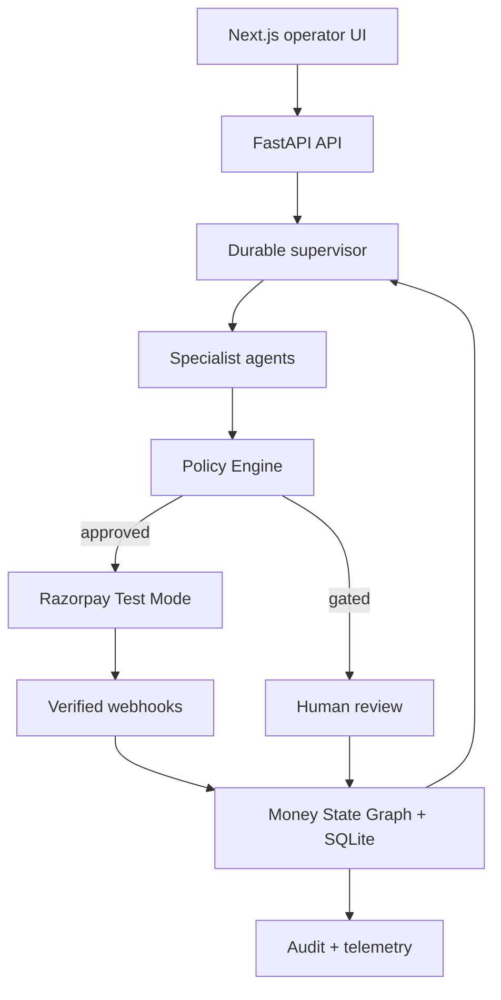
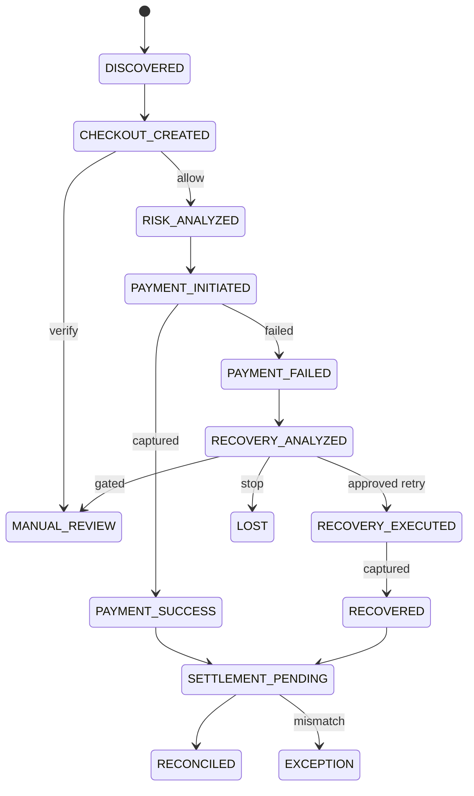

# RupeeOS

> A policy-constrained, multi-agent operating system for the complete Razorpay money lifecycle.

RupeeOS follows one rupee from product discovery through risk assessment, payment, failed-payment recovery, settlement, and reconciliation. A durable supervisor selects specialist agents from the current Money State Graph, records every step, and pauses at human or external-payment boundaries. Agents can recommend; only the deterministic Policy Engine can authorize a money-related action.

**Razorpay Buildathon · Open Track · Test Mode only**

## Why RupeeOS

Most payment demos stop after opening checkout. RupeeOS models the operational work around a payment:

- One persistent Money State Graph across commerce, risk, recovery, and finance.
- A real supervisor loop with step budgets, state-based delegation, pause/resume, and durable traces.
- Five bounded agents: Supervisor, Growth, Risk, Recovery, and Finance.
- Server-enforced policy gates for high-value payments, retry count, recovery confidence, amount limits, and circuit-breaker state.
- Human approval inbox for decisions outside autonomous limits.
- Razorpay Test Mode orders, checkout signature verification, signed webhooks, and webhook idempotency.
- Fresh Razorpay orders for approved recovery attempts.
- Tamper-evident audit chains with a verification endpoint.
- Repeatable synthetic recovery evaluation kept separate from live transaction metrics.

## Architecture



The system is intentionally hybrid. Agent reasoning is bounded and inspectable; deterministic policy controls side effects. No model calls, token usage, accuracy claims, or recovered-revenue claims are fabricated.

## What makes it agentic

`POST /agentic/runs` starts a durable goal-directed workflow. On every step the supervisor:

1. Observes the current Money State Graph state.
2. Selects the specialist that is allowed to act in that state.
3. Captures observation, concise rationale, recommendation, confidence, evidence, and policy result.
4. Executes only an explicitly enabled, policy-approved action.
5. Persists the trace and stops at a terminal state, step budget, human gate, checkout, webhook, or settlement boundary.

Runs can be inspected through `GET /agentic/runs/{run_id}` and resumed with `POST /agentic/runs/{run_id}/resume`. The UI shows the live agent registry and recent supervisor traces in Command Center.

## Money State Graph



## Tech stack

| Layer | Technology |
| --- | --- |
| Frontend | Next.js 16, React 19, TypeScript, Tailwind CSS 4 |
| API | FastAPI, Pydantic |
| State and audit | SQLAlchemy, SQLite by default; PostgreSQL-compatible URL override |
| Payments | Razorpay Python SDK and Standard Checkout |
| Tests | Pytest, FastAPI TestClient, ESLint, Next.js production build |
| Delivery | Docker Compose and GitHub Actions |

## Repository layout

```text
rupeeos/
├── backend/
│   ├── agents/                 # bounded specialist decision engines
│   ├── models/                 # API, money-state, and workflow contracts
│   ├── services/               # supervisor, policy, audit, DB, Razorpay
│   ├── tests/                  # safety and workflow regressions
│   └── main.py                 # FastAPI routes
├── frontend/                   # Next.js operator experience
├── data/                       # demo catalog and transactions
├── docs/                       # architecture, API, demo, and security model
├── .github/                    # CI, Dependabot, issue and PR templates
└── docker-compose.yml
```

## Quick start

### Requirements

- Python 3.12+
- Node.js 22+
- Razorpay Test Mode key pair and webhook secret for real checkout/webhook flows

### 1. Run the backend

Windows PowerShell:

```powershell
cd backend
python -m venv .venv
.\.venv\Scripts\Activate.ps1
pip install -r requirements-dev.txt
Copy-Item .env.example .env
uvicorn main:app --reload --port 8000
```

macOS/Linux:

```bash
cd backend
python -m venv .venv
source .venv/bin/activate
pip install -r requirements-dev.txt
cp .env.example .env
uvicorn main:app --reload --port 8000
```

Open [http://localhost:8000/docs](http://localhost:8000/docs). Readiness is available at [http://localhost:8000/health/ready](http://localhost:8000/health/ready).

### 2. Run the frontend

```bash
cd frontend
npm ci
```

Copy `.env.example` to `.env.local`, then:

```bash
npm run dev
```

Open [http://localhost:3000](http://localhost:3000).

### 3. Configure Razorpay Test Mode

Set these values in `backend/.env`:

```dotenv
RAZORPAY_KEY_ID=rzp_test_...
RAZORPAY_KEY_SECRET=...
RAZORPAY_WEBHOOK_SECRET=...
```

Expose the API for local webhook delivery:

```bash
cloudflared tunnel --url http://localhost:8000
```

Create a Razorpay webhook pointing to:

```text
https://YOUR-TUNNEL.trycloudflare.com/webhooks/razorpay
```

Subscribe to `payment.captured` and `payment.failed`, and use the exact same webhook secret in Razorpay and `backend/.env`.

## Docker Compose

From the repository root:

```bash
docker compose up --build
```

The UI runs on port `3000`, the API on `8000`, and SQLite data is persisted in a named volume. Pass Razorpay variables through your shell or a root `.env` file.

## Agentic API example

Create a transaction and checkout first, then start a safe supervisor run:

```bash
curl -X POST http://localhost:8000/agentic/runs \
  -H "Content-Type: application/json" \
  -d '{
    "money_id": "txn_replace_me",
    "goal": "ASSESS_AND_ROUTE_PAYMENT",
    "max_steps": 4,
    "execute_external_actions": false
  }'
```

With `execute_external_actions=false`, the run deliberately pauses before creating a Razorpay order. Resume with explicit permission:

```bash
curl -X POST http://localhost:8000/agentic/runs/run_replace_me/resume \
  -H "Content-Type: application/json" \
  -d '{"execute_external_actions": true}'
```

## Tests

```bash
cd backend
python -m pytest -q

cd ../frontend
npm run lint
npm run build
```

The core suite covers high-value human approval, webhook idempotency, reconciliation, supervisor routing, step-budget enforcement, audit-chain verification, request validation, and readiness.

## Demo path

1. Commerce: select a product and create checkout.
2. Risk: run the agentic supervisor and inspect the policy result.
3. Payment: use Razorpay Test Mode checkout.
4. Recovery: send a verified failure through bounded recovery.
5. Finance: reconcile captured or recovered payments.
6. Command Center: show the graph, live agents, durable traces, approvals, circuit breaker, evaluation, and audit evidence.

See [docs/DEMO.md](docs/DEMO.md) for a judge-ready script.

## Documentation

- [Architecture](docs/ARCHITECTURE.md)
- [API reference](docs/API.md)
- [Security and agent safety](docs/SECURITY_MODEL.md)
- [Demo guide](docs/DEMO.md)
- [Deployment guide](docs/DEPLOYMENT.md)
- [Contributing](CONTRIBUTING.md)
- [Security policy](SECURITY.md)
- [Changelog](CHANGELOG.md)

## Production boundary

This repository is a Buildathon system designed for Razorpay **Test Mode**. Before real-money production use, add authenticated identities and role-based access control, a managed PostgreSQL database with migrations, a durable task queue, distributed locking/idempotency, encrypted secret management, observability export, rate limiting, backups, and a formal risk/compliance review. The current UI’s human reviewer name is demonstration metadata, not authentication.

## License

Released under the [MIT License](LICENSE).
