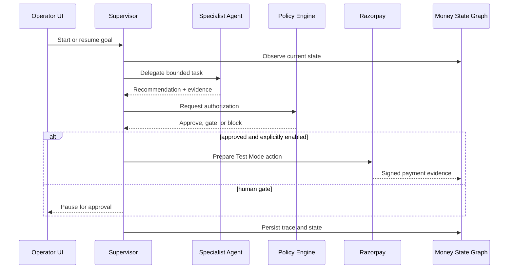

# RupeeOS Architecture

## Design goal

RupeeOS coordinates specialized decision engines around a single persistent money object while preventing any agent from independently moving money. The architecture separates recommendation, authorization, execution, evidence, and human intervention.

## Control flow

## Components

### Money State Graph

`TransactionRow` is the persisted money object. The orchestrator validates transitions against `VALID_TRANSITIONS`; callers cannot arbitrarily set a lifecycle state. Each transition also creates a hash-chained audit record.

### Durable supervisor

The supervisor stores each run in `agent_workflows`. A run has a goal, current agent, status, stop reason, maximum step count, external-action permission, pending checkout, and ordered steps. Each step records an observation, concise rationale, recommendation, action, outcome, confidence, evidence, and the relevant policy decision.

The runtime is synchronous for the Buildathon deployment but durable across process restarts. A production deployment should move run execution to a task queue and use database-level leases.

### Specialist agents

| Agent | Reads | Produces | Cannot do |
| --- | --- | --- | --- |
| Growth | query, budget, catalog | product and add-on recommendation | create orders or payments |
| Risk | amount, customer-history signals | score, factors, ALLOW/VERIFY/HOLD | approve or create a payment |
| Recovery | failure evidence, amount, attempts | probability and retry/escalate/stop | exceed retry or amount limits |
| Finance | expected and received settlement records | match, fee-adjusted match, exception | initiate payouts |
| Supervisor | Money State Graph, policy result | plan steps and safe routing | bypass policy or verified evidence |

### Policy Engine

The Policy Engine is deterministic and separate from agent recommendation. It enforces:

- high-value verification threshold;
- maximum recovery attempts;
- minimum recovery probability;
- maximum autonomous recovery amount;
- system circuit-breaker state.

### External evidence

Razorpay checkout success is verified with the order/payment signature. Webhook signatures are calculated over the raw request body. `x-razorpay-event-id` provides delivery idempotency, with a payload hash fallback if the header is absent. Unknown and out-of-order events are persisted without forcing an invalid transition.

### Human-in-the-loop

Policy can create a durable manual review. Approval advances the state or creates a fresh recovery order; rejection moves the transaction to an explicit terminal exception/lost state. Reviewer labels in the demo are not authenticated user identities.

## Failure boundaries

| Stop reason | Meaning | Resume condition |
| --- | --- | --- |
| `EXTERNAL_ACTIONS_DISABLED` | Run lacks permission to call Razorpay | Resume with permission or use explicit endpoint |
| `PAYMENT_CHECKOUT_REQUIRED` | Order exists; customer action is required | Checkout verification/webhook |
| `PAYMENT_EVENT_REQUIRED` | Awaiting provider evidence | Signed webhook or server verification |
| `HUMAN_APPROVAL_REQUIRED` | Policy requires a person | Resolve manual review |
| `SETTLEMENT_INPUT_REQUIRED` | Finance lacks settlement evidence | Submit reconciliation batch |
| `MAX_STEPS_REACHED` | Execution budget exhausted | Resume with a larger budget after inspection |

## Persistence

SQLite is the default because it keeps the demo self-contained. `RUPEEOS_DATABASE_URL` can point SQLAlchemy at PostgreSQL, but schema migrations and concurrency controls must be added before production use.
