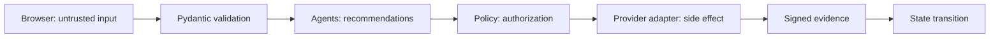

# Security and Agent Safety Model

## Safety invariant

No specialist agent has a direct payment-provider capability. Agents return recommendations and evidence. The deterministic Policy Engine authorizes an action, and the supervisor executes it only when the run explicitly allows external actions.

## Implemented controls

- Strict Money State Graph transitions.
- Pydantic validation and bounded collection sizes for public request bodies.
- Human gates for high-value, ambiguous, high-risk, or circuit-breaker conditions.
- Recovery retry count, probability threshold, and autonomous amount ceiling.
- Explicit external-action permission on agentic runs.
- Step budgets that prevent unbounded supervisor loops.
- Razorpay checkout and webhook signature verification with constant-time comparison.
- Webhook idempotency and out-of-order event handling.
- Persistent decision, workflow, and audit telemetry.
- SHA-256-linked audit chains and an independent verification endpoint.
- Test Mode wording throughout payment interfaces.
- Demo controls can be disabled through configuration.
- Secret and runtime-file exclusions in `.gitignore` and `.dockerignore`.

## Trust boundaries

## Known production gaps

The Buildathon version does not yet provide authentication, role-based access control, CSRF protection for an authenticated deployment, distributed rate limiting, database migrations, row-level concurrency/leases, a durable queue, managed secrets, encrypted customer data, OpenTelemetry export, backup/restore, or formal PCI/compliance certification. SQLite and in-process execution are appropriate for the demo, not horizontally scaled real-money operation.

## LLM/model policy

The optional OpenAI reasoning layer advertises the actual engine used. If disabled, unconfigured, invalid, unavailable, or outside the allowed routing/action set, execution falls back to deterministic agents. The implementation:

1. Require a strict structured schema and reject invalid output.
2. Treat model output as untrusted recommendation data.
3. Keeps policy evaluation deterministic.
4. Removes secret-like fields before sending bounded transaction evidence.
5. Uses strict structured output and rejects unauthorized specialist or action selections.
6. Allows AI to make a rule recommendation stricter, never more permissive.
7. Records the real provider, model, and latency without fabricated token or cost values.
8. Never gives the model raw secret material or a payment-provider client.
